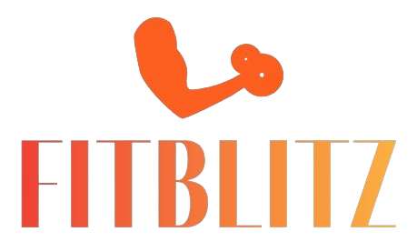

# FitBlitz-Fitness-for-Everybody
FitBlitz is a modern fitness website designed to inspire and guide individuals on their fitness journey. It provides information about fitness programs, nutrition plans, blogs, and contact details, all wrapped in a responsive and visually appealing design.
## Table of Contents

- [Features](#features)
- [Project Structure](#project-structure)
- [Technologies Used](#technologies-used)
- [How to Use](#how-to-use)
- [Screenshots](#screenshots)
- [License](#license)
- [Contact](#contact)

---

## Features

- **Responsive Design**: Fully responsive layout for all devices.
- **Fitness Programs**: Explore various fitness programs like Strength, Physical Fitness, Fat Loss, and Weight Gain.
- **Nutrition Plans**: Tailored nutrition plans to complement fitness goals.
- **Blogs**: Informative blogs on fitness, wellness, and healthy living.
- **Contact Us**: Easy-to-use contact form and location details.
- **Animations**: Smooth fade-in animations for enhanced user experience.
- **Modern Navigation**: Mobile-friendly navigation with a toggle menu.

---

## Project Structure

FitBlitz/
├── animations.css # CSS for animations 
├── animations.js # JavaScript for animations 
├── blogs.html # Blogs page
├── contact.html # Contact Us page 
├── form-validation.js # JavaScript for form validation 
├── index.html # Homepage 
├── styles.css # Main CSS file

---
## Technologies Used

- **HTML5**: For structuring the content.
- **CSS3**: For styling and responsive design.
- **JavaScript**: For interactivity and animations.
- **Remix Icon**: For modern icons.
- **Google Fonts**: For typography.

---

## How to Use

1. Clone the repository or download the project files.
2. Open `index.html` in your browser to view the homepage.
3. Navigate through the pages using the navigation bar.
4. Explore the features like fitness programs, blogs, and contact form.

---

## Screenshots

### Homepage

### Blogs Page

### Contact Page

---

## License

This project is licensed under the MIT License. Feel free to use and modify it as per your needs.

---

## Contact

For any inquiries or feedback, please reach out to us:

- **Email**: info@fitblitz.com
- **Phone**: 0112227857 | 0774567322
- **Address**: 144/B James Street, Colombo 3
